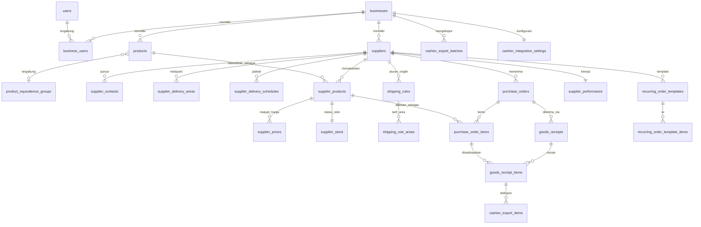

# DATA_MODEL.md — Rancangan Model Data

## Sistem Supplier & Perbandingan Harga

Konvensi umum:

- Primary key: `id UUID DEFAULT gen_random_uuid()` (butuh ekstensi
  `pgcrypto` atau `uuid-ossp` di PostgreSQL).
- Semua tabel milik tenant memiliki `business_id UUID NOT NULL REFERENCES
businesses(id)` dan **wajib** diindeks.
- Kolom uang: `numeric(18,2)`. Kolom rasio/harga per satuan yang butuh
  presisi antara: `numeric(18,4)`.
- Kolom kuantitas fisik (isi kemasan, stok): `numeric(14,4)` agar dapat
  menampung pecahan (mis. 0.5 liter) tanpa galat pembulatan.
- Audit dasar (R28): `created_at timestamptz NOT NULL DEFAULT now()`,
  `updated_at timestamptz NOT NULL DEFAULT now()` (di-trigger update
  otomatis), `created_by UUID NOT NULL REFERENCES users(id)`.
- Soft-deactivate, bukan hard delete, untuk entitas master (`is_active
boolean NOT NULL DEFAULT true`).

---

## 1. `businesses`

| Kolom                  | Tipe        | Constraint                                                      |
| ---------------------- | ----------- | --------------------------------------------------------------- |
| id                     | UUID        | PK                                                              |
| name                   | text        | NOT NULL                                                        |
| owner_name             | text        | NOT NULL                                                        |
| default_address        | text        | NULL — alamat pengiriman utama untuk pengecekan jangkauan/jarak |
| timezone               | text        | NOT NULL DEFAULT 'Asia/Jakarta'                                 |
| is_active              | boolean     | NOT NULL DEFAULT true                                           |
| created_at, updated_at | timestamptz | NOT NULL                                                        |

---

## 2. `users`

| Kolom                  | Tipe        | Constraint            |
| ---------------------- | ----------- | --------------------- |
| id                     | UUID        | PK                    |
| name                   | text        | NOT NULL              |
| email                  | citext      | UNIQUE, NOT NULL      |
| password_hash          | text        | NOT NULL              |
| is_active              | boolean     | NOT NULL DEFAULT true |
| last_login_at          | timestamptz | NULL                  |
| created_at, updated_at | timestamptz | NOT NULL              |

Catatan: `email` sebagai `citext` agar unik tanpa case-sensitivity. Tabel
sesi/token Auth.js (`sessions`, `verification_tokens`, dll.) mengikuti skema
adapter Prisma standar, tidak dirinci di sini.

## 3. `business_users`

Tabel relasi many-to-many user ↔ business + peran.

| Kolom                  | Tipe                        | Constraint                    |
| ---------------------- | --------------------------- | ----------------------------- |
| id                     | UUID                        | PK                            |
| business_id            | UUID                        | FK → businesses(id), NOT NULL |
| user_id                | UUID                        | FK → users(id), NOT NULL      |
| role                   | enum(`owner_admin`,`staff`) | NOT NULL                      |
| is_active              | boolean                     | NOT NULL DEFAULT true         |
| created_at, updated_at | timestamptz                 | NOT NULL                      |

Constraint: `UNIQUE (business_id, user_id)`.
Index: `(user_id)`, `(business_id)`.

---

## 4. `suppliers`

| Kolom                              | Tipe          | Constraint                                                                                                  |
| ---------------------------------- | ------------- | ----------------------------------------------------------------------------------------------------------- |
| id                                 | UUID          | PK                                                                                                          |
| business_id                        | UUID          | FK, NOT NULL                                                                                                |
| supplier_name                      | text          | NOT NULL                                                                                                    |
| company_name                       | text          | NULL                                                                                                        |
| contact_name                       | text          | NULL                                                                                                        |
| phone_number                       | text          | NOT NULL                                                                                                    |
| whatsapp_number                    | text          | NULL                                                                                                        |
| email                              | citext        | NULL                                                                                                        |
| address                            | text          | NOT NULL                                                                                                    |
| city                               | text          | NOT NULL                                                                                                    |
| province                           | text          | NOT NULL                                                                                                    |
| district                           | text          | NULL — kecamatan                                                                                            |
| postal_code                        | text          | NULL                                                                                                        |
| map_location                       | text          | NULL — link Google Maps atau `lat,lng`                                                                      |
| operating_hours                    | text          | NULL — deskripsi jam operasional                                                                            |
| lead_time_days_min                 | integer       | NOT NULL DEFAULT 0, CHECK ≥ 0                                                                               |
| lead_time_days_max                 | integer       | NOT NULL, CHECK ≥ `lead_time_days_min`                                                                      |
| order_cutoff_time                  | time          | NULL                                                                                                        |
| order_cutoff_days                  | text[]        | NULL — hari berlaku cut-off, mis. `{Senin,Rabu}`                                                            |
| min_purchase_amount                | numeric(18,2) | NULL, CHECK ≥ 0 — minimum pembelian dalam Rupiah (terpisah dari minimum per kemasan di `supplier_products`) |
| payment_method                     | text          | NULL                                                                                                        |
| payment_term_days                  | integer       | NULL, CHECK ≥ 0 — tempo pembayaran                                                                          |
| notes                              | text          | NULL                                                                                                        |
| is_active                          | boolean       | NOT NULL DEFAULT true                                                                                       |
| created_at, updated_at, created_by | —             | NOT NULL                                                                                                    |

Index: `(business_id)`, `(business_id, is_active)`, `(business_id, city)`.

## 5. `supplier_contacts`

Kontak tambahan di luar kontak utama pada `suppliers` (opsional, mis. admin
gudang, sales).

| Kolom                  | Tipe        | Constraint                                       |
| ---------------------- | ----------- | ------------------------------------------------ |
| id                     | UUID        | PK                                               |
| supplier_id            | UUID        | FK → suppliers(id), NOT NULL                     |
| business_id            | UUID        | FK, NOT NULL (denormalisasi untuk scoping cepat) |
| contact_name           | text        | NOT NULL                                         |
| role_title             | text        | NULL                                             |
| phone_number           | text        | NULL                                             |
| whatsapp_number        | text        | NULL                                             |
| email                  | citext      | NULL                                             |
| is_primary             | boolean     | NOT NULL DEFAULT false                           |
| created_at, updated_at | timestamptz | NOT NULL                                         |

Index: `(supplier_id)`.

## 6. `supplier_delivery_areas`

Area pengiriman supplier (R01), dipakai untuk cek "melayani lokasi
pengguna" (R14) dan label "Paling Dekat" (R13).

| Kolom                  | Tipe        | Constraint                   |
| ---------------------- | ----------- | ---------------------------- |
| id                     | UUID        | PK                           |
| supplier_id            | UUID        | FK → suppliers(id), NOT NULL |
| business_id            | UUID        | FK, NOT NULL                 |
| province               | text        | NOT NULL                     |
| city                   | text        | NULL                         |
| district               | text        | NULL                         |
| notes                  | text        | NULL                         |
| created_at, updated_at | timestamptz | NOT NULL                     |

Index: `(supplier_id)`, `(business_id, province, city)`.

## 7. `supplier_delivery_schedules`

Hari pengiriman rutin (R01, R19).

| Kolom                  | Tipe        | Constraint                                 |
| ---------------------- | ----------- | ------------------------------------------ |
| id                     | UUID        | PK                                         |
| supplier_id            | UUID        | FK → suppliers(id), NOT NULL               |
| business_id            | UUID        | FK, NOT NULL                               |
| day_of_week            | smallint    | NOT NULL, CHECK BETWEEN 0 AND 6 (0=Minggu) |
| notes                  | text        | NULL                                       |
| created_at, updated_at | timestamptz | NOT NULL                                   |

Constraint: `UNIQUE (supplier_id, day_of_week)`.

---

## 8. `product_categories`

| Kolom                  | Tipe        | Constraint            |
| ---------------------- | ----------- | --------------------- |
| id                     | UUID        | PK                    |
| business_id            | UUID        | FK, NOT NULL          |
| name                   | text        | NOT NULL              |
| is_active              | boolean     | NOT NULL DEFAULT true |
| created_at, updated_at | timestamptz | NOT NULL              |

Constraint: `UNIQUE (business_id, name)`.

## 9. `products`

| Kolom                              | Tipe                                                       | Constraint                                  |
| ---------------------------------- | ---------------------------------------------------------- | ------------------------------------------- |
| id                                 | UUID                                                       | PK                                          |
| business_id                        | UUID                                                       | FK, NOT NULL                                |
| sku                                | text                                                       | NOT NULL                                    |
| barcode                            | text                                                       | NULL                                        |
| product_name                       | text                                                       | NOT NULL                                    |
| brand                              | text                                                       | NULL                                        |
| variant                            | text                                                       | NULL                                        |
| category_id                        | UUID                                                       | FK → product_categories(id), NULL           |
| photo_url                          | text                                                       | NULL                                        |
| unit_family                        | enum(`WEIGHT`,`VOLUME`,`COUNT`)                            | NOT NULL — "jenis satuan pembanding"        |
| base_unit                          | enum(`GRAM`,`KILOGRAM`,`MILLILITER`,`LITER`,`PCS`,`LUSIN`) | NOT NULL                                    |
| equivalence_group_id               | UUID                                                       | FK → `product_equivalence_groups(id)`, NULL |
| is_active                          | boolean                                                    | NOT NULL DEFAULT true                       |
| created_at, updated_at, created_by | —                                                          | NOT NULL                                    |

Constraint: `UNIQUE (business_id, sku)`.
Constraint aplikasi (di-enforce di `lib/domain/units`, didukung `CHECK`
sederhana di DB bila memungkinkan): `base_unit` harus konsisten dengan
`unit_family` (mis. `WEIGHT` → `GRAM`/`KILOGRAM`).
Index: `(business_id)`, `(business_id, is_active)`, `(business_id, barcode)`.

## 10. `product_equivalence_groups`

Menjawab R05 poin terakhir: produk berbeda tidak boleh dibandingkan tanpa
kelompok produk setara yang **ditandai manual** oleh pengguna (lihat asumsi
`SPEC.md` §7.1).

| Kolom                              | Tipe | Constraint                                   |
| ---------------------------------- | ---- | -------------------------------------------- |
| id                                 | UUID | PK                                           |
| business_id                        | UUID | FK, NOT NULL                                 |
| group_name                         | text | NOT NULL                                     |
| unit_family                        | enum | NOT NULL — harus sama dengan seluruh anggota |
| notes                              | text | NULL                                         |
| created_at, updated_at, created_by | —    | NOT NULL                                     |

---

## 11. `tax_rates`

Tarif pajak dapat diatur, tidak hardcode (R07).

| Kolom                              | Tipe         | Constraint                |
| ---------------------------------- | ------------ | ------------------------- |
| id                                 | UUID         | PK                        |
| business_id                        | UUID         | FK, NOT NULL              |
| name                               | text         | NOT NULL — mis. "PPN 11%" |
| rate_percent                       | numeric(6,3) | NOT NULL, CHECK ≥ 0       |
| is_default                         | boolean      | NOT NULL DEFAULT false    |
| is_active                          | boolean      | NOT NULL DEFAULT true     |
| created_at, updated_at, created_by | —            | NOT NULL                  |

Index: `(business_id, is_active)`.

---

## 12. `supplier_products`

Definisi penawaran (relatif statis): kemasan & aturan pembelian (R03).

| Kolom                              | Tipe                                                                                | Constraint                                                                                                                       |
| ---------------------------------- | ----------------------------------------------------------------------------------- | -------------------------------------------------------------------------------------------------------------------------------- |
| id                                 | UUID                                                                                | PK                                                                                                                               |
| business_id                        | UUID                                                                                | FK, NOT NULL                                                                                                                     |
| supplier_id                        | UUID                                                                                | FK → suppliers(id), NOT NULL                                                                                                     |
| product_id                         | UUID                                                                                | FK → products(id), NOT NULL                                                                                                      |
| supplier_sku_or_name               | text                                                                                | NULL — nama/kode versi supplier                                                                                                  |
| package_type                       | enum(`DUS`,`PAK`,`KARUNG`,`BOTOL`,`KALENG`,`SAK`,`BAL`,`TRAY`,`BOX`,`PCS_LANGSUNG`) | NOT NULL                                                                                                                         |
| items_per_package                  | numeric(14,4)                                                                       | NOT NULL, CHECK > 0                                                                                                              |
| content_per_item                   | numeric(14,4)                                                                       | NOT NULL, CHECK > 0 — dalam satuan dasar produk                                                                                  |
| total_package_content              | numeric(14,4)                                                                       | NOT NULL, CHECK > 0 — kolom generated: `items_per_package * content_per_item`, atau dihitung di service layer saat insert/update |
| base_unit                          | enum                                                                                | NOT NULL — salinan `products.base_unit` untuk integritas tampilan                                                                |
| min_purchase_packages              | numeric(14,4)                                                                       | NOT NULL DEFAULT 1, CHECK > 0                                                                                                    |
| purchase_multiple_packages         | numeric(14,4)                                                                       | NOT NULL DEFAULT 1, CHECK > 0                                                                                                    |
| estimated_delivery_days_min        | integer                                                                             | NULL, CHECK ≥ 0                                                                                                                  |
| estimated_delivery_days_max        | integer                                                                             | NULL, CHECK ≥ `estimated_delivery_days_min`                                                                                      |
| is_active                          | boolean                                                                             | NOT NULL DEFAULT true                                                                                                            |
| created_at, updated_at, created_by | —                                                                                   | NOT NULL                                                                                                                         |

Constraint: `UNIQUE (supplier_id, product_id, package_type,
supplier_sku_or_name)` untuk mencegah duplikasi penawaran identik.
Index: `(business_id)`, `(product_id)`, `(supplier_id)`,
`(business_id, product_id, is_active)`.

Catatan implementasi: `total_package_content` sebaiknya `GENERATED ALWAYS
AS (items_per_package * content_per_item) STORED` bila didukung versi
PostgreSQL yang dipakai; jika tidak, dihitung ulang di service layer setiap
kali baris ditulis, tidak pernah diterima sebagai input mentah dari klien.

---

## 13. `supplier_prices`

**Append-only** (R20) — riwayat harga & status pajak. Baris terbaru per
`supplier_product_id` (berdasarkan `created_at`) adalah harga aktif.

| Kolom                   | Tipe                               | Constraint                                                                                                   |
| ----------------------- | ---------------------------------- | ------------------------------------------------------------------------------------------------------------ |
| id                      | UUID                               | PK                                                                                                           |
| business_id             | UUID                               | FK, NOT NULL                                                                                                 |
| supplier_product_id     | UUID                               | FK → supplier_products(id), NOT NULL                                                                         |
| price_per_package       | numeric(18,2)                      | NOT NULL, CHECK ≥ 0                                                                                          |
| tax_status              | enum(`INCLUDED`,`EXCLUDED`,`NONE`) | NOT NULL                                                                                                     |
| tax_rate_id             | UUID                               | FK → tax_rates(id), NULL (NULL wajib jika `tax_status = NONE`)                                               |
| tax_rate_value_snapshot | numeric(6,3)                       | NULL, CHECK ≥ 0 — nilai tarif saat entri dibuat, agar riwayat tidak berubah bila `tax_rates` diedit kemudian |
| price_source_note       | text                               | NULL — mis. "update dari nota tanggal ..."                                                                   |
| created_at              | timestamptz                        | NOT NULL DEFAULT now()                                                                                       |
| created_by              | UUID                               | FK → users(id), NOT NULL                                                                                     |

Index: `(supplier_product_id, created_at DESC)` — untuk mengambil harga
terkini secara efisien.
Larangan aplikasi: repository layer **tidak menyediakan** operasi
`UPDATE`/`DELETE` untuk tabel ini; hanya `INSERT` dan `SELECT`.

## 14. `supplier_stock`

Status ketersediaan & stok — state terkini (mutable), bukan riwayat wajib
(R09), tapi mencatat `updated_at` untuk kebutuhan R12 ("tanggal pembaruan
stok").

| Kolom               | Tipe                                                                     | Constraint                                   |
| ------------------- | ------------------------------------------------------------------------ | -------------------------------------------- |
| id                  | UUID                                                                     | PK                                           |
| business_id         | UUID                                                                     | FK, NOT NULL                                 |
| supplier_product_id | UUID                                                                     | FK → supplier_products(id), UNIQUE, NOT NULL |
| availability_status | enum(`TERSEDIA`,`STOK_TERBATAS`,`KOSONG`,`PRE_ORDER`,`PERLU_KONFIRMASI`) | NOT NULL                                     |
| stock_qty           | numeric(14,4)                                                            | NULL, CHECK ≥ 0                              |
| updated_at          | timestamptz                                                              | NOT NULL DEFAULT now()                       |
| updated_by          | UUID                                                                     | FK → users(id), NOT NULL                     |

Index: `(supplier_product_id)` (unique, sekaligus index).

---

## 15. `shipping_rules`

Enam mode ongkir (R08).

| Kolom                              | Tipe                                                                                                      | Constraint                                            |
| ---------------------------------- | --------------------------------------------------------------------------------------------------------- | ----------------------------------------------------- |
| id                                 | UUID                                                                                                      | PK                                                    |
| business_id                        | UUID                                                                                                      | FK, NOT NULL                                          |
| supplier_id                        | UUID                                                                                                      | FK → suppliers(id), NOT NULL                          |
| rule_type                          | enum(`GRATIS_TANPA_SYARAT`,`GRATIS_MIN_PEMBELIAN`,`TETAP`,`BERDASARKAN_AREA`,`PICKUP`,`PERLU_KONFIRMASI`) | NOT NULL                                              |
| free_shipping_min_amount           | numeric(18,2)                                                                                             | NULL, CHECK ≥ 0 — dipakai jika `GRATIS_MIN_PEMBELIAN` |
| flat_fee                           | numeric(18,2)                                                                                             | NULL, CHECK ≥ 0 — dipakai jika `TETAP`                |
| notes                              | text                                                                                                      | NULL                                                  |
| is_active                          | boolean                                                                                                   | NOT NULL DEFAULT true                                 |
| created_at, updated_at, created_by | —                                                                                                         | NOT NULL                                              |

Constraint: hanya satu `shipping_rules` aktif per supplier pada satu waktu
(`UNIQUE (supplier_id) WHERE is_active`), kecuali desain ke depan memakai
prioritas — cukup satu untuk cakupan awal.

## 16. `shipping_rule_areas`

Tarif berbeda per area untuk mode `BERDASARKAN_AREA`.

| Kolom                  | Tipe          | Constraint                        |
| ---------------------- | ------------- | --------------------------------- |
| id                     | UUID          | PK                                |
| shipping_rule_id       | UUID          | FK → shipping_rules(id), NOT NULL |
| business_id            | UUID          | FK, NOT NULL                      |
| province               | text          | NOT NULL                          |
| city                   | text          | NULL                              |
| fee                    | numeric(18,2) | NOT NULL, CHECK ≥ 0               |
| created_at, updated_at | timestamptz   | NOT NULL                          |

Index: `(shipping_rule_id)`.

---

## 16a. `business_locations` (baru - pengembangan lanjutan 2026-08-18)

Lokasi/cabang bisnis, lihat docs/BACKLOG.md #1. Sengaja tabel TERPISAH
dari `businesses` walau saat ini baru dipakai 1 baris per bisnis
(ditandai `is_default`), agar bisa menambah cabang lain nanti tanpa
migrasi ulang skema. Dipakai mengisi otomatis alamat tujuan pada
halaman Bandingkan & Pesanan.

| Kolom                  | Tipe        | Constraint             |
| ---------------------- | ----------- | ---------------------- |
| id                     | UUID        | PK                     |
| business_id            | UUID        | FK, NOT NULL           |
| name                   | text        | NOT NULL               |
| province               | text        | NOT NULL               |
| city                   | text        | NULL                   |
| district               | text        | NULL                   |
| address                | text        | NULL                   |
| is_default             | boolean     | NOT NULL DEFAULT false |
| is_active              | boolean     | NOT NULL DEFAULT true  |
| created_at, updated_at | timestamptz | NOT NULL               |

Index: `(business_id, is_active)`.

---

## 17. `purchase_orders`

R16.

> **Catatan revisi (pengembangan lanjutan disepakati 2026-08-18, lihat
> docs/BACKLOG.md #4):** implementasi aktual (`prisma/schema.prisma`)
> berbeda dari rancangan awal di bawah ini pada beberapa hal -
> `shipping_address` diganti relasi opsional `location_id` ->
> `business_locations` (bukan teks bebas); kolom `subtotal`/`tax_total`/
> `shipping_fee`/`total`/`scheduled_date` BELUM diimplementasikan (total
> dihitung on-the-fly dari `purchase_order_items`, bukan disimpan
> redundan, karena beberapa baris bisa `TIDAK_TERSEDIA`/`SEBAGIAN` yang
> mengubah total setelah konfirmasi - lihat `computeOrderTotal()` di
> `purchase-order-repository.ts`); status enum menambah `DIKONFIRMASI`
> (antara `DIPESAN` dan `DIKIRIM`) dan kolom baru `payment_method` enum
> (`TUNAI`/`TRANSFER`), `sent_at`/`confirmed_at`/`cancelled_at`
> timestamptz. Alur saat ini BERHENTI di `DIKONFIRMASI` - transisi ke
> `DIKIRIM`/`DITERIMA` menyusul bersama R18 (`goods_receipts`, belum
> dikerjakan).

| Kolom                              | Tipe                                                      | Constraint                                                              |
| ---------------------------------- | --------------------------------------------------------- | ----------------------------------------------------------------------- |
| id                                 | UUID                                                      | PK                                                                      |
| business_id                        | UUID                                                      | FK, NOT NULL                                                            |
| order_number                       | text                                                      | NOT NULL — format `PO-YYYY-NNNN` dibuat di service layer                |
| supplier_id                        | UUID                                                      | FK → suppliers(id), NOT NULL                                            |
| status                             | enum(`DRAFT`,`DIPESAN`,`DIKIRIM`,`DITERIMA`,`DIBATALKAN`) | NOT NULL DEFAULT `DRAFT`                                                |
| shipping_address                   | text                                                      | NOT NULL                                                                |
| scheduled_date                     | date                                                      | NULL                                                                    |
| notes                              | text                                                      | NULL                                                                    |
| subtotal                           | numeric(18,2)                                             | NOT NULL DEFAULT 0, CHECK ≥ 0                                           |
| tax_total                          | numeric(18,2)                                             | NOT NULL DEFAULT 0, CHECK ≥ 0                                           |
| shipping_fee                       | numeric(18,2)                                             | NOT NULL DEFAULT 0, CHECK ≥ 0                                           |
| total                              | numeric(18,2)                                             | NOT NULL DEFAULT 0, CHECK ≥ 0                                           |
| cancel_reason                      | text                                                      | NULL — NOT NULL bila `status = DIBATALKAN` (di-enforce trigger/service) |
| created_at, updated_at, created_by | —                                                         | NOT NULL                                                                |

Constraint: `UNIQUE (business_id, order_number)`.
Index: `(business_id, status)`, `(supplier_id)`.

## 18. `purchase_order_items`

> **Catatan revisi (pengembangan lanjutan disepakati 2026-08-18, lihat
> docs/BACKLOG.md #4):** `tax_amount_snapshot`/`line_total` BELUM
> diimplementasikan (`taxRateValueSnapshot` disimpan sebagai persentase
> mentah, bukan nominal pajak, agar bisa dihitung ulang lewat
> `calculateSubtotal()` bila diperlukan - konsisten dengan
> `SupplierPrice.taxRateValueSnapshot`). Ditambah 2 kolom baru:
> `availability_status` enum (`BELUM_DIKONFIRMASI`/`TERSEDIA`/
> `SEBAGIAN`/`TIDAK_TERSEDIA`, ditandai MANUAL oleh pengguna setelah
> balasan WhatsApp supplier - TIDAK ada integrasi otomatis) dan
> `confirmed_package_qty` (diisi hanya untuk status `SEBAGIAN`). Pesan
> WhatsApp yang dikirim (R17, versi revisi) TIDAK menyertakan harga -
> kolom harga di tabel ini murni catatan/kalkulasi internal aplikasi.
> Constraint TAMBAHAN: `UNIQUE (purchase_order_id, supplier_product_id)`
>
> - menambah produk yang sama ke pesanan yang sama menaikkan
>   `package_qty` baris yang ada (perilaku "keranjang"), bukan baris baru.

| Kolom                      | Tipe          | Constraint                                                               |
| -------------------------- | ------------- | ------------------------------------------------------------------------ |
| id                         | UUID          | PK                                                                       |
| purchase_order_id          | UUID          | FK → purchase_orders(id), NOT NULL                                       |
| business_id                | UUID          | FK, NOT NULL                                                             |
| supplier_product_id        | UUID          | FK → supplier_products(id), NOT NULL                                     |
| package_qty                | numeric(14,4) | NOT NULL, CHECK > 0                                                      |
| price_per_package_snapshot | numeric(18,2) | NOT NULL, CHECK ≥ 0 — diambil dari `supplier_prices` saat pesanan dibuat |
| tax_status_snapshot        | enum          | NOT NULL                                                                 |
| tax_amount_snapshot        | numeric(18,2) | NOT NULL DEFAULT 0, CHECK ≥ 0                                            |
| line_subtotal              | numeric(18,2) | NOT NULL, CHECK ≥ 0                                                      |
| line_total                 | numeric(18,2) | NOT NULL, CHECK ≥ 0                                                      |
| notes                      | text          | NULL                                                                     |
| created_at, updated_at     | timestamptz   | NOT NULL                                                                 |

Index: `(purchase_order_id)`, `(supplier_product_id)`.

---

## 19. `goods_receipts`

R18.

| Kolom                              | Tipe                     | Constraint                         |
| ---------------------------------- | ------------------------ | ---------------------------------- |
| id                                 | UUID                     | PK                                 |
| business_id                        | UUID                     | FK, NOT NULL                       |
| purchase_order_id                  | UUID                     | FK → purchase_orders(id), NOT NULL |
| received_at                        | timestamptz              | NOT NULL                           |
| is_partial                         | boolean                  | NOT NULL DEFAULT false             |
| overall_completeness               | enum(`LENGKAP`,`KURANG`) | NOT NULL                           |
| on_time                            | boolean                  | NOT NULL                           |
| receipt_photo_url                  | text                     | NULL                               |
| notes                              | text                     | NULL                               |
| created_at, updated_at, created_by | —                        | NOT NULL                           |

Index: `(purchase_order_id)`, `(business_id, received_at)`.

## 20. `goods_receipt_items`

| Kolom                    | Tipe          | Constraint                                           |
| ------------------------ | ------------- | ---------------------------------------------------- |
| id                       | UUID          | PK                                                   |
| goods_receipt_id         | UUID          | FK → goods_receipts(id), NOT NULL                    |
| purchase_order_item_id   | UUID          | FK → purchase_order_items(id), NOT NULL              |
| business_id              | UUID          | FK, NOT NULL                                         |
| ordered_qty              | numeric(14,4) | NOT NULL, CHECK > 0                                  |
| received_qty             | numeric(14,4) | NOT NULL, CHECK ≥ 0                                  |
| condition_good_qty       | numeric(14,4) | NOT NULL DEFAULT 0, CHECK ≥ 0                        |
| condition_damaged_qty    | numeric(14,4) | NOT NULL DEFAULT 0, CHECK ≥ 0                        |
| price_matches            | boolean       | NOT NULL                                             |
| actual_price_per_package | numeric(18,2) | NULL, CHECK ≥ 0 — diisi jika `price_matches = false` |
| notes                    | text          | NULL                                                 |
| created_at, updated_at   | timestamptz   | NOT NULL                                             |

Constraint: `CHECK (condition_good_qty + condition_damaged_qty <=
received_qty)`.
Index: `(goods_receipt_id)`, `(purchase_order_item_id)`.

---

## 21. `supplier_performance`

Agregat kinerja, direkomputasi setelah tiap `goods_receipt` baru dicatat
(R14, R15). Bukan sumber kebenaran (source of truth tetap
`goods_receipts`/`purchase_orders`), melainkan cache baca cepat.

| Kolom                  | Tipe         | Constraint                                                                        |
| ---------------------- | ------------ | --------------------------------------------------------------------------------- |
| id                     | UUID         | PK                                                                                |
| business_id            | UUID         | FK, NOT NULL                                                                      |
| supplier_id            | UUID         | FK → suppliers(id), UNIQUE, NOT NULL                                              |
| completed_orders_count | integer      | NOT NULL DEFAULT 0, CHECK ≥ 0                                                     |
| on_time_count          | integer      | NOT NULL DEFAULT 0, CHECK ≥ 0, CHECK ≤ `completed_orders_count`                   |
| on_time_rate           | numeric(6,4) | NOT NULL DEFAULT 0.5 — hasil rumus `(on_time_count+1)/(completed_orders_count+2)` |
| last_calculated_at     | timestamptz  | NOT NULL                                                                          |

Index: `(supplier_id)` (unique).

---

## 22. `recurring_order_templates`

R19.

| Kolom                              | Tipe                       | Constraint                                            |
| ---------------------------------- | -------------------------- | ----------------------------------------------------- |
| id                                 | UUID                       | PK                                                    |
| business_id                        | UUID                       | FK, NOT NULL                                          |
| supplier_id                        | UUID                       | FK → suppliers(id), NOT NULL                          |
| template_name                      | text                       | NOT NULL                                              |
| frequency                          | enum(`MINGGUAN`,`BULANAN`) | NOT NULL                                              |
| day_of_week                        | smallint                   | NULL, CHECK BETWEEN 0 AND 6 — dipakai jika `MINGGUAN` |
| day_of_month                       | smallint                   | NULL, CHECK BETWEEN 1 AND 31 — dipakai jika `BULANAN` |
| reminder_lead_days                 | integer                    | NOT NULL DEFAULT 1, CHECK ≥ 0                         |
| next_run_date                      | date                       | NULL — tanggal disarankan pengingat berikutnya        |
| is_active                          | boolean                    | NOT NULL DEFAULT true                                 |
| created_at, updated_at, created_by | —                          | NOT NULL                                              |

## 23. `recurring_order_template_items`

| Kolom               | Tipe          | Constraint                                   |
| ------------------- | ------------- | -------------------------------------------- |
| id                  | UUID          | PK                                           |
| template_id         | UUID          | FK → recurring_order_templates(id), NOT NULL |
| supplier_product_id | UUID          | FK → supplier_products(id), NOT NULL         |
| package_qty         | numeric(14,4) | NOT NULL, CHECK > 0                          |
| notes               | text          | NULL                                         |

## 24. `reminders`

| Kolom                              | Tipe                               | Constraint                                                           |
| ---------------------------------- | ---------------------------------- | -------------------------------------------------------------------- |
| id                                 | UUID                               | PK                                                                   |
| business_id                        | UUID                               | FK, NOT NULL                                                         |
| reminder_type                      | enum(`RECURRING_ORDER`,`CUSTOM`)   | NOT NULL                                                             |
| reference_id                       | UUID                               | NULL — id `recurring_order_templates` atau `purchase_orders` terkait |
| remind_at                          | timestamptz                        | NOT NULL                                                             |
| message                            | text                               | NOT NULL                                                             |
| status                             | enum(`PENDING`,`SENT`,`DISMISSED`) | NOT NULL DEFAULT `PENDING`                                           |
| created_at, updated_at, created_by | —                                  | NOT NULL                                                             |

Index: `(business_id, status, remind_at)`.

---

## 25. `cashier_export_batches`

R22.

| Kolom          | Tipe                       | Constraint                               |
| -------------- | -------------------------- | ---------------------------------------- |
| id             | UUID                       | PK                                       |
| business_id    | UUID                       | FK, NOT NULL                             |
| format         | enum(`CSV`,`JSON`)         | NOT NULL                                 |
| generated_at   | timestamptz                | NOT NULL DEFAULT now()                   |
| generated_by   | UUID                       | FK → users(id), NOT NULL                 |
| file_reference | text                       | NULL — path/URL penyimpanan hasil ekspor |
| status         | enum(`GENERATED`,`FAILED`) | NOT NULL DEFAULT `GENERATED`             |

## 26. `cashier_export_items`

Baris per item yang diekspor, sesuai field wajib R22.

| Kolom                 | Tipe          | Constraint                                |
| --------------------- | ------------- | ----------------------------------------- |
| id                    | UUID          | PK                                        |
| batch_id              | UUID          | FK → cashier_export_batches(id), NOT NULL |
| goods_receipt_item_id | UUID          | FK → goods_receipt_items(id), NOT NULL    |
| sku                   | text          | NOT NULL                                  |
| barcode               | text          | NULL                                      |
| product_name          | text          | NOT NULL                                  |
| received_qty          | numeric(14,4) | NOT NULL                                  |
| unit                  | text          | NOT NULL                                  |
| purchase_price        | numeric(18,2) | NOT NULL                                  |
| supplier_name         | text          | NOT NULL                                  |
| purchase_order_number | text          | NOT NULL                                  |
| received_at           | timestamptz   | NOT NULL                                  |
| total_purchase        | numeric(18,2) | NOT NULL                                  |

Index: `(batch_id)`.

## 27. `cashier_integration_settings`

Konfigurasi untuk mode integrasi masa depan (REST API/webhook). Tidak
menyimpan secret asli — hanya referensi/nama secret yang dikelola di
environment/secret manager (R31).

| Kolom                              | Tipe                                    | Constraint                                                   |
| ---------------------------------- | --------------------------------------- | ------------------------------------------------------------ |
| id                                 | UUID                                    | PK                                                           |
| business_id                        | UUID                                    | FK, UNIQUE, NOT NULL                                         |
| method                             | enum(`CSV`,`JSON`,`REST_API`,`WEBHOOK`) | NOT NULL DEFAULT `CSV`                                       |
| endpoint_url                       | text                                    | NULL — dipakai jika `REST_API`/`WEBHOOK`                     |
| secret_ref                         | text                                    | NULL — nama/alias secret di secret manager, bukan nilai asli |
| is_enabled                         | boolean                                 | NOT NULL DEFAULT false                                       |
| created_at, updated_at, created_by | —                                       | NOT NULL                                                     |

---

## 28. Ringkasan Relasi (ERD Tekstual)

---

## 29. Catatan Konsistensi Uang & Satuan (rujukan cepat)

- Semua `numeric` uang: presisi `(18,2)`; tidak ada kolom uang bertipe
  `float`/`double precision` di manapun pada skema ini (menegakkan R27
  di level DDL, bukan hanya kode aplikasi).
- `supplier_prices` dan `purchase_order_items` menyimpan **snapshot** nilai
  pajak/harga, bukan referensi hidup ke `tax_rates`, agar dokumen historis
  (pesanan lama) tidak berubah retroaktif saat kebijakan pajak berubah.
- Field kuantitas fisik (`items_per_package`, `content_per_item`,
  `stock_qty`, dst.) memakai `numeric(14,4)`, bukan integer, karena satuan
  seperti liter/kg dapat pecahan.
- Enum `base_unit` pada `products`/`supplier_products` dibatasi ke 6 nilai
  satuan dasar baku (bukan kemasan) agar mesin konversi (`lib/domain/units`)
  punya domain nilai yang tertutup dan dapat diverifikasi lengkap oleh
  compiler TypeScript (exhaustiveness check).
